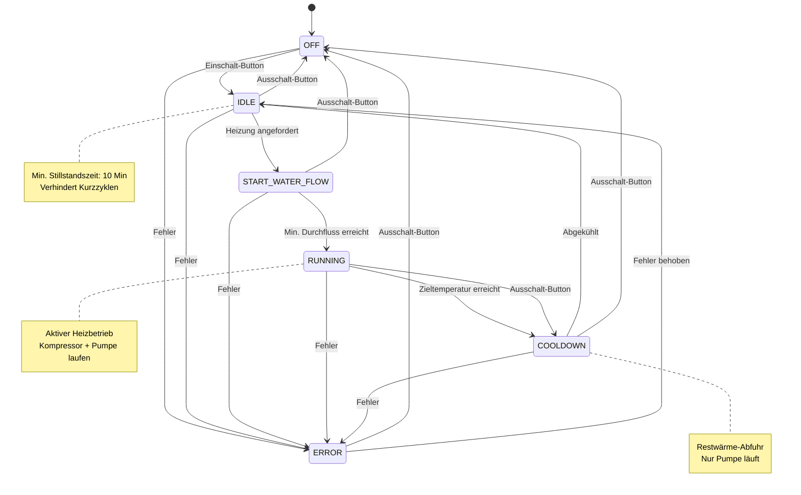

# State Machine Dokumentation - Wärmepumpen-Steuerung

## Übersicht

Die Wärmepumpen-Steuerung verwendet das **State Pattern** (Zustandsmuster) zur Implementierung einer robusten, ereignisgesteuerten Steuerungslogik. Die State Machine besteht aus 6 verschiedenen Zuständen, die jeweils spezifische Verhaltensweisen und Übergangsbedingungen definieren.

## Architektur

- **Zentrale Komponente**: `FB_StateMachine` (Heatpump/POUs/FB_StateMachine.TcPOU)
- **Interface**: `I_State` - definiert den Vertrag für alle Zustände
- **6 Zustands-Implementierungen**: Jeder Zustand ist als eigener Function Block implementiert
- **Polymorphismus**: Alle Zustände implementieren das gleiche Interface `I_State`

## State Machine Diagramm

### Vereinfachtes Zustandsdiagramm



### Detaillierte Übergänge mit Bedingungen und Aktionen

#### Von OFF (Aus)

| Übergang | Event | Bedingungen | Aktionen |
|----------|-------|-------------|----------|
| **OFF → IDLE** | Einschalt-Button / Bestätigung | - | • LED einschalten |
| **OFF → ERROR** | Fehler erkannt | Beliebiger Fehler | • Fehler loggen<br>• System sichern |

#### Von IDLE (Bereit)

| Übergang | Event | Bedingungen | Aktionen |
|----------|-------|-------------|----------|
| **IDLE → START_WATER_FLOW** | Heizung angefordert | • Timer abgelaufen ODER nicht aktiv<br>• Puffer oben < Zieltemp. (33°C / 40°C PV)<br>• ODER Boiler-Anforderung aktiv<br>• UND Rücklauftemp. ≤ 53°C | • Timer stoppen<br>• Ventil öffnen |
| **IDLE → OFF** | Ausschalt-Button | - | • System zurücksetzen |
| **IDLE → ERROR** | Fehler erkannt | Beliebiger Fehler | • Fehler loggen |

#### Von START_WATER_FLOW (Ventil öffnen)

| Übergang | Event | Bedingungen | Aktionen |
|----------|-------|-------------|----------|
| **START_WATER_FLOW → RUNNING** | Min. Durchfluss erreicht | • incident.incidentFlow = TRUE<br>• (mind. 1800 L/h) | • Wasserpumpe einschalten<br>• Kompressor einschalten |
| **START_WATER_FLOW → OFF** | Ausschalt-Button | - | • Ventil schließen<br>• Alles ausschalten |
| **START_WATER_FLOW → ERROR** | Fehler erkannt | • Kein Durchfluss (Timeout)<br>• Druck/Temp-Fehler | • Ventil schließen<br>• Alles ausschalten |

#### Von RUNNING (Kompressor ein)

| Übergang | Event | Bedingungen | Aktionen |
|----------|-------|-------------|----------|
| **RUNNING → COOLDOWN** | Zieltemperatur erreicht | • Puffer Mitte ≥ Zieltemp. (41°C / 50°C PV)<br>• UND Boiler-Anforderung = FALSE<br>• ODER Rücklauftemp. > 53°C | • Min-Idle-Timer starten (10 Min)<br>• Kompressor ausschalten<br>• Ventil schließen<br>• **Pumpe läuft weiter!** |
| **RUNNING → COOLDOWN** | Ausschalt-Button | - | • Min-Idle-Timer starten (10 Min)<br>• Kompressor ausschalten<br>• Ventil schließen<br>• **Pumpe läuft weiter!** |
| **RUNNING → ERROR** | Fehler erkannt | • Druckdiff. Verdampfer > 45 mbar<br>• Verdampfer Austritt < 2.3°C<br>• Durchfluss zu niedrig<br>• Druck-Thermostat ausgelöst<br>• Motorschutz ausgelöst | • Min-Idle-Timer starten<br>• Alles ausschalten |

#### Von COOLDOWN (Abkühlen)

| Übergang | Event | Bedingungen | Aktionen |
|----------|-------|-------------|----------|
| **COOLDOWN → IDLE** | Abgekühlt | • (T_Vorlauf - T_Rücklauf) < 1.0°C | • Wasserpumpe ausschalten<br>• Min-Idle-Timer läuft weiter |
| **COOLDOWN → OFF** | Ausschalt-Button | - | • Wasserpumpe bleibt an<br>• (Kühlung fortsetzen) |
| **COOLDOWN → ERROR** | Fehler erkannt | Beliebiger Fehler | • Fehler loggen |

#### Von ERROR (Fehler)

| Übergang | Event | Bedingungen | Aktionen |
|----------|-------|-------------|----------|
| **ERROR → IDLE** | Automatisch | • Alle Fehler-Flags = FALSE | • System bereit |
| **ERROR → OFF** | Ausschalt-Button | - | • System zurücksetzen<br>• Alles ausschalten |

## Detaillierte Zustandsbeschreibung

### 1. OFF (Aus)

**Implementierung**: `FB_OffState.TcPOU`
**Name**: "aus"
**Beschreibung**: Die Wärmepumpe ist manuell ausgeschaltet

#### Ausgänge
- `operatingStateLed` = FALSE
- `operatingStateWaterPump` = FALSE
- `operatingStateCompressor` = FALSE
- Ventil geschlossen

#### Übergänge

| Von | Nach | Event | Bedingung | Aktion |
|-----|------|-------|-----------|--------|
| OFF | IDLE | UserPressedSwitchOnButton | Einschalt-Button gedrückt | LED = TRUE |
| OFF | IDLE | UserPressedConfirmationButton | Bestätigung im OFF-Zustand | LED = TRUE |
| OFF | ERROR | ErrorDetected | Fehler erkannt | Transition zu ERROR |

#### Code-Referenz
```
UserPressedSwitchOnButton():
  LogMessage('Einschalt Button wurde gedrückt')
  pd.actor.operatingStateLed := TRUE
  SetState(IdleState)
```

---

### 2. IDLE (Bereit)

**Implementierung**: `FB_IdleState.TcPOU`
**Name**: "bereit"
**Beschreibung**: Wärmepumpe ist betriebsbereit und wartet auf Heizanforderung

#### Ausgänge
- `operatingStateLed` = TRUE
- `operatingStateWaterPump` = FALSE
- `operatingStateCompressor` = FALSE
- Ventil geschlossen

#### Mindest-Stillstandszeit
Der Zustand IDLE erzwingt eine **Mindest-Ausschaltdauer von 10 Minuten** (konfigurierbar: `GVL.configValues.minIdleSec`), um häufige Starts des Kompressors zu vermeiden (Schutz vor Kurzzyklen).

**Timer-Implementierung**:
- Timer startet beim Eintritt in IDLE (von COOLDOWN kommend)
- Event `HeatIsRequested` wird nur ausgeführt wenn: `timerTON.Q = TRUE` ODER `timerTON.IN = FALSE`
- HMI zeigt verbleibende Zeit an, wenn Timer aktiv

#### Übergänge

| Von | Nach | Event | Bedingung | Aktion |
|-----|------|-------|-----------|--------|
| IDLE | START_WATER_FLOW | HeatIsRequested | • Timer abgelaufen ODER nicht aktiv<br>• `bufferTopTemperature < targetTemperatureOn`<br>• ODER Boiler-Anforderung aktiv<br>• UND `temperatureReturn ≤ 53°C` | Timer stoppen, Ventil öffnen |
| IDLE | OFF | UserPressedSwitchOffButton | Ausschalt-Button gedrückt | resetApplication() |
| IDLE | ERROR | ErrorDetected | Fehler erkannt | Transition zu ERROR |

#### Heizanforderungs-Logik (isHeatRequested)

**Bedingungen** (ALLE müssen erfüllt sein):
```
1. Aktueller Zustand = IDLE
2. temperatureReturn ≤ maxReturnTemperature (53°C)
3. Mindestens EINE der folgenden Bedingungen:
   a) bufferTopTemperature < targetTemperatureOn
      - Standard: 33°C
      - PV-Modus: 40°C (wenn photovoltaicSurplus = TRUE)
   b) boilerHeatRequest = TRUE
      UND bufferTopTemperature ≤ (boilerTemperature + 4°C)
```

**Code-Referenz** (FB_StateMachine.isHeatRequested):
```
isHeatRequested :=
  ((pd.sensor.bufferTopTemperature < calculateTargetTemperatureOn(pd.sensor.photovoltaicSurplus)) OR
   (pd.sensor.boilerHeatRequest = TRUE AND
    (pd.sensor.bufferTopTemperature <= pd.sensor.boilerTemperature + GVL.configValues.temperatureDiffBoilerLaden)))
  AND iState.State = E_State.IDLE
  AND pd.sensor.temperatureReturn <= GVL.configValues.maxReturnTemperature
```

---

### 3. START_WATER_FLOW (Ventil öffnen / Durchfluss starten)

**Implementierung**: `FB_StartWaterFlowState.TcPOU`
**Name**: "öffne Ventil"
**Beschreibung**: Öffnet das Wasserventil und wartet auf ausreichenden Durchfluss

#### Ausgänge
- `operatingStateLed` = TRUE
- `operatingStateWaterPump` = FALSE (noch nicht!)
- `operatingStateCompressor` = FALSE (noch nicht!)
- **Ventil öffnen** (Relais: closeFlowVentil = FALSE, openFlowVentil = TRUE)

#### Sicherheitskonzept
Dieser Zustand stellt sicher, dass **ZUERST** ausreichend Wasser durch den Verdampfer fließt, **BEVOR** der Kompressor startet. Dies verhindert:
- Einfrieren des Verdampfers
- Überhitzung durch fehlende Wärmeabfuhr
- Beschädigung des Kompressors

#### Übergänge

| Von | Nach | Event | Bedingung | Aktion |
|-----|------|-------|-----------|--------|
| START_WATER_FLOW | RUNNING | MinWaterFlowReached | `incident.incidentFlow = TRUE`<br>(mind. 1800 L/h) | Wasserpumpe = TRUE<br>Kompressor = TRUE |
| START_WATER_FLOW | OFF | UserPressedSwitchOffButton | Ausschalt-Button gedrückt | Ventil schließen<br>Alles ausschalten |
| START_WATER_FLOW | ERROR | ErrorDetected | Timeout oder Fehler | Fehler loggen<br>Ventil schließen |

#### Code-Referenz
```
MinWaterFlowReached():
  LogMessage('Ventil ist geöffnet. Durchflussmenge erreicht.')
  pd.actor.operatingStateWaterPump := TRUE
  pd.actor.operatingStateCompressor := TRUE
  SetState(RunningState)
```

---

### 4. RUNNING (Kompressor ein / Heizbetrieb)

**Implementierung**: `FB_RunningState.TcPOU`
**Name**: "Kompressor ein"
**Beschreibung**: Aktiver Heizbetrieb - Wärmepumpe produziert Wärme

#### Ausgänge
- `operatingStateLed` = TRUE
- `operatingStateWaterPump` = TRUE
- `operatingStateCompressor` = TRUE
- Ventil geöffnet

#### Überwachung
In diesem Zustand werden kontinuierlich alle Sicherheitsparameter überwacht:
- Druckdifferenz am Verdampfer (max. 45 mbar)
- Austrittstemperatur am Verdampfer (min. 2.3°C - Gefrierschutz)
- Durchflussmenge (mind. 1800 L/h)
- Hochdruck (max. 16 bar)
- Niederdruck (max. 6 bar)
- Motorschutzschalter
- Expansionsventil-Alarm

#### Übergänge

| Von | Nach | Event | Bedingung | Aktion |
|-----|------|-------|-----------|--------|
| RUNNING | COOLDOWN | TargetTemperatureReached | • `bufferMiddleTemperature ≥ targetTemperatureOff`<br>• UND `boilerHeatRequest = FALSE`<br>• ODER `temperatureReturn > 53°C` | Min-Idle-Timer starten (10 Min)<br>Kompressor = FALSE<br>Ventil schließen<br>Pumpe läuft weiter! |
| RUNNING | COOLDOWN | UserPressedSwitchOffButton | Ausschalt-Button gedrückt | Min-Idle-Timer starten<br>ActionSwitchOff() |
| RUNNING | ERROR | ErrorDetected | Sicherheitsgrenze überschritten | Min-Idle-Timer starten<br>Fehler loggen<br>Alles ausschalten |

#### Ausschalt-Logik (isTargetTemperatureReached)

**Bedingungen** (ALLE müssen erfüllt sein):
```
1. Aktueller Zustand = RUNNING
2. Mindestens EINE der folgenden Bedingungen:
   a) (bufferMiddleTemperature ≥ targetTemperatureOff
       UND boilerHeatRequest = FALSE)
      - Standard: 41°C
      - PV-Modus: 50°C (wenn photovoltaicSurplus = TRUE)
   b) temperatureReturn > maxReturnTemperature (53°C)
      (Sicherheitsabschaltung!)
```

**Code-Referenz** (FB_StateMachine.isTargetTemperatureReached):
```
isTargetTemperatureReached :=
  ((pd.sensor.bufferMiddleTemperature >= calculateTargetTemperatureOff(pd.sensor.photovoltaicSurplus))
    AND (pd.sensor.boilerHeatRequest = FALSE)
    OR pd.sensor.temperatureReturn > GVL.configValues.maxReturnTemperature)
  AND (iState.State = E_State.RUNNING)
```

#### ActionSwitchOff (gemeinsame Ausschalt-Routine)
```
ActionSwitchOff(message):
  timerTON(IN := TRUE, PT := configValues.minIdleSec)  // 10 Min Timer
  LogMessage(message)
  pd.actor.operatingStateCompressor := FALSE
  switchWaterVentil(bOpen := FALSE)
  SetState(CoolDownState)
  // WICHTIG: Wasserpumpe läuft weiter!
```

---

### 5. COOLDOWN (Abkühlen)

**Implementierung**: `FB_CoolDownState.TcPOU`
**Name**: "abkühlen"
**Beschreibung**: Nachlaufphase zur Abkühlung des Verflüssigers

#### Ausgänge
- `operatingStateLed` = TRUE
- `operatingStateWaterPump` = TRUE (läuft weiter!)
- `operatingStateCompressor` = FALSE (aus)
- Ventil geschlossen

#### Zweck der Cooldown-Phase
Nach dem Ausschalten des Kompressors befindet sich im Verflüssiger (Kondensator) noch Restwärme. Die Wasserpumpe läuft weiter und transportiert diese Wärme ab. Dies:
- Verhindert unnötigen Wärmeverlust durch Abstrahlung
- Nutzt die Restwärme zur Pufferbeladung
- Schont die Komponenten durch kontrollierte Abkühlung

#### Abkühlkriterium
Die Cooldown-Phase endet, wenn die **Temperaturdifferenz zwischen Vorlauf und Rücklauf kleiner als 1.0°C** ist:

```
(temperatureFlow - temperatureReturn) < 1.0°C
```

Dies zeigt an, dass kein nennenswerter Wärmetransport mehr stattfindet.

#### Übergänge

| Von | Nach | Event | Bedingung | Aktion |
|-----|------|-------|-----------|--------|
| COOLDOWN | IDLE | WaterHasCooledDown | `(T_Vorlauf - T_Rücklauf) < 1.0°C` | Wasserpumpe = FALSE<br>Timer läuft weiter |
| COOLDOWN | OFF | UserPressedSwitchOffButton | Ausschalt-Button gedrückt | Pumpe bleibt an<br>(Kühlung fortsetzen!) |
| COOLDOWN | ERROR | ErrorDetected | Fehler erkannt | Fehler loggen |

#### Code-Referenz (FB_StateMachine.generateEvents)
```
ELSIF ((pd.sensor.temperatureFlow - pd.sensor.temperatureReturn)
       < GVL.configValues.temperatureDiffBacklashOff
       AND iState.State = E_State.COOLDOWN) THEN
  events.cooledDown.isTriggered := TRUE
```

#### Code-Referenz (FB_CoolDownState.WaterHasCooledDown)
```
WaterHasCooledDown():
  LogMessage('Abkühlungsphase beendet')
  pd.actor.operatingStateWaterPump := FALSE
  SetState(IdleState)
```

---

### 6. ERROR (Fehler)

**Implementierung**: `FB_ErrorState.TcPOU`
**Name**: "Error"
**Beschreibung**: Ein Fehler wurde erkannt, Wärmepumpe in Sicherheitszustand

#### Ausgänge
- `operatingStateLed` = TRUE (blinkt/rot - implementierungsabhängig)
- `operatingStateWaterPump` = FALSE
- `operatingStateCompressor` = FALSE
- Ventil geschlossen

#### Fehlerarten (E_ErrorEvent)

| Error Event | Bedingung | Schwelle | Aktion |
|-------------|-----------|----------|--------|
| **PressureDiffEvaporatorTooHigh** | `pressureDifferenceEvaporator > max` | 45 mbar | Sofort-Stopp<br>(Einfrier-Gefahr) |
| **EvaporatingTemperatureTooLow** | `temperatureEvaporatingOut < min` | 2.3°C | Sofort-Stopp<br>(Gefrier-Schutz) |
| **EvaporatingFlowRateTooLow** | `incidentFlow = FALSE`<br>(nur im RUNNING Zustand) | < 1800 L/h | Sofort-Stopp<br>(Überhitzung) |
| **LowPressureRefrigerationThermostat** | `incidentLowPressure = TRUE` | Ranco-Thermostat | Hardware-Schutz<br>ausgelöst |
| **HighPressureRefrigerationThermostat** | `incidentHighPressure = TRUE` | Ranco-Thermostat | Hardware-Schutz<br>ausgelöst |
| **MotorProtectionTriggered** | `incidentCompressor = TRUE` | Motorschutz | Hardware-Schutz<br>ausgelöst |
| **ExpansionValveTriggered** | `alarmExpansionValve = TRUE` | EEV-Alarm | Ventil-Fehler |

#### Fehler-Behandlung (FB_StateMachine.generateEvents, Zeile 170-206)

Alle Fehler werden in jedem Zyklus überprüft. Bei Fehler:
```
setEventInfo(events, events.errorEvents.XXX, TRUE, 'Fehlermeldung')
```

Dies setzt:
- `events.errorsDetected = TRUE`
- Fehler-Flag in `errorEvents` Struktur
- Fehlertext für Anzeige

#### Übergänge

| Von | Nach | Event | Bedingung | Aktion |
|-----|------|-------|-----------|--------|
| ERROR | IDLE | - (automatisch) | Alle Fehler behoben<br>(`errorsDetected = FALSE`) | System bereit |
| ERROR | OFF | UserPressedSwitchOffButton | Ausschalt-Button gedrückt | resetApplication()<br>Alles ausschalten |

#### Automatische Fehlerbeseitigung (FB_StateMachine, Zeile 55-60)
```
IF events.errorsDetected THEN
  iState.ErrorDetected(events.errorEvents)
ELSIF iState.State = E_State.ERROR THEN
  LogMessage('Fehler steht nicht mehr an -> Idle')
  SetState(IdleState)
END_IF
```

Wenn keine Fehler mehr anstehen, erfolgt **automatisch** der Übergang zurück zu IDLE!

#### transitionToErrorState Utility Funktion
Zentrale Fehlerbehandlung für alle Zustände:
```
transitionToErrorState(errorEvents, pMachine):
  1. Alle Aktoren ausschalten (Kompressor, Pumpe)
  2. Ventil schließen
  3. Fehler in globalem Array speichern (GVL.lastErrorsOccurred)
  4. Fehlermeldungen generieren
  5. Übergang zu ErrorState
  6. Fehler loggen mit Timestamp
```

---

## Event-Generierung (FB_StateMachine.generateEvents)

Die Methode `generateEvents()` wird in **jedem PLC-Zyklus** aufgerufen und bewertet alle Sensoren und Bedingungen. Sie generiert Events, die dann an den aktuellen Zustand weitergeleitet werden.

### Event-Priorisierung (Zeile 156-168)

Die Events werden in **fester Reihenfolge** geprüft (IF-ELSIF-Kette):

```
1. switchOff             (höchste Priorität - Sicherheit)
2. switchOn
3. heatIsRequested
4. cooledDown
5. targetTemperatureReached
6. minWaterFlowReached   (niedrigste Priorität)
```

**Wichtig**: Pro Zyklus wird nur **EIN** Event ausgelöst (erste zutreffende Bedingung gewinnt)!

### Error-Checking (Zeile 170-230)

Fehlerprüfungen laufen **parallel** und **unabhängig** von anderen Events:
- Werden IMMER geprüft (nicht in IF-ELSIF-Kette)
- Können mehrere Fehler gleichzeitig erkennen
- Haben implizit höchste Priorität (werden vor Events verarbeitet, Zeile 55)

### Event-Struktur (ST_Events)

```
TYPE ST_Events :
STRUCT
  switchOn                  : ST_Event
  switchOff                 : ST_Event
  heatIsRequested          : ST_Event
  targetTemperatureReached : ST_Event
  cooledDown               : ST_Event
  minWaterFlowReached      : ST_Event
  confirmed                : ST_Event
  errorsDetected           : BOOL
  errorEvents              : ST_ErrorEvents
  warningEvents            : ST_WarningEvents
END_STRUCT
END_TYPE
```

Jedes Event hat:
- `isTriggered`: BOOL (TRUE = Event ist aufgetreten)
- Optional: Zusätzliche Informationen

---

## Aktor-Steuerung

### Digitale Ausgänge (EL2004)

| Aktor | Variable | Beschreibung | Steuerung |
|-------|----------|--------------|-----------|
| Kompressor | `actor.operatingStateCompressor` | Kompressor-Schütz | Nur in RUNNING = TRUE |
| Wasserpumpe | `actor.operatingStateWaterPump` | Quellwasser-Pumpe | In RUNNING + COOLDOWN = TRUE |
| Status-LED | `actor.operatingStateLed` | Betriebs-LED | Alle Zustände außer OFF = TRUE |

### Relais-Ausgänge (EL2622 - 230V AC, 4A)

| Relais | Variable | Beschreibung | Steuerung |
|--------|----------|--------------|-----------|
| Ventil Öffnen | `openFlowVentil` | Ventil-Spule "Auf" | Kurzer Impuls zum Öffnen |
| Ventil Schließen | `closeFlowVentil` | Ventil-Spule "Zu" | Kurzer Impuls zum Schließen |

**Utility-Funktion** `switchWaterVentil(bOpen, pMachine)`:
- Steuert beide Relais
- Implementiert Impulssteuerung (bistabiles Ventil)
- Wird in allen Zustandsübergängen verwendet

---

## Timing und Zyklen

### PLC-Zyklus
- **Zykluszeit**: Typisch 10-50 ms (abhängig von Task-Konfiguration)
- Jeder Zyklus:
  1. `FB_Processdata` liest Sensoren
  2. `FB_StateMachine` generiert Events
  3. Events werden an aktuellen State dispatched
  4. State führt Transition aus (oder nicht)
  5. Aktoren werden geschrieben

### Timer
- **TON Timer** (`timerTON`): Implementiert Mindest-Stillstandszeit
  - Typ: TON (Timer On Delay)
  - Startet beim Übergang RUNNING → COOLDOWN
  - Läuft während COOLDOWN und IDLE
  - Verhindert zu frühen Neustart
  - Default: PT = 600 Sekunden (10 Minuten)

### Rising Edge Trigger
Alle Benutzer-Eingaben verwenden Rising Edge Detection:
```
rtrigButtonSwitchOn     : R_TRIG    // Einschalt-Button
rtrigButtonSwitchOff    : R_TRIG    // Ausschalt-Button
rtrigButtonConfirmation : R_TRIG    // Bestätigung (Quittierung)
```

Dies verhindert Mehrfach-Auslösung bei gedrücktem Button.

---

## Konfigurierbare Parameter (GVL.configValues)

Alle Schwellwerte sind zur Laufzeit konfigurierbar (persistent):

### Temperaturen

| Parameter | Default | PV-Modus | Beschreibung |
|-----------|---------|----------|--------------|
| `targetTemperatureOn` | 33°C | 40°C | Einschalttemperatur (Puffer oben) |
| `targetTemperatureOff` | 41°C | 50°C | Ausschalttemperatur (Puffer Mitte) |
| `maxReturnTemperature` | 53°C | 53°C | Maximale Rücklauftemperatur (Sicherheit) |
| `temperatureDiffBoilerLaden` | 4.0°C | - | Hysterese Boiler-Laden |
| `temperatureDiffBacklashOff` | 1.0°C | - | Abkühl-Schwelle (ΔT Vorlauf-Rücklauf) |
| `EvaporatingTemperatureOutMin` | 2.3°C | - | Min. Verdampfer-Austrittstemperatur |

### Drücke

| Parameter | Default | Einheit | Beschreibung |
|-----------|---------|---------|--------------|
| `PressureHighMax` | 16 | bar | Max. Hochdruck (berechnet, Warning) |
| `PressureLowMax` | 6 | bar | Max. Niederdruck (berechnet, Warning) |
| `PressureDifferenceEvaporatorMax` | 45 | mbar | Max. Druckdifferenz Verdampfer (Error!) |

### Zeiten

| Parameter | Default | Einheit | Beschreibung |
|-----------|---------|---------|--------------|
| `minIdleSec` | 600 | Sekunden | Mindest-Stillstandszeit (10 Min) |

---

## Sicherheitskonzept

### Mehrfache Absicherung
1. **Hardware-Thermostaten**:
   - Hochdruck-Thermostat (Ranco)
   - Niederdruck-Thermostat (Ranco)
   - Motorschutzschalter
   → Bei Auslösung: `incidentHighPressure` / `incidentLowPressure` / `incidentCompressor`

2. **Software-Überwachung**:
   - Druckdifferenz am Verdampfer (Einfrieren)
   - Austrittstemperatur am Verdampfer (Gefrierpunkt)
   - Durchflussmenge (Wärmemangel)
   - Berechnete Drücke (Warning vor Hardware-Auslösung)

3. **Zeitbasierte Sicherheit**:
   - Mindest-Stillstandszeit verhindert Kurzzyklen
   - Cooldown-Phase schützt vor Heißstart

### Fehler-Hierarchie
1. **Error** (sofortiger Stopp):
   - Hardware-Schutzeinrichtungen ausgelöst
   - Gefriergefahr am Verdampfer
   - Durchflussmangel während Betrieb
   → System geht in ERROR-Zustand

2. **Warning** (keine Aktion, nur Anzeige):
   - Drücke über Sollwert, aber unter Thermostaten
   - Informative Hinweise für Wartung
   → System läuft weiter

### Redundante Durchfluss-Überwachung
- **Vor dem Start** (START_WATER_FLOW): Ventil öffnen, auf Durchfluss warten
- **Während Betrieb** (RUNNING): Kontinuierliche Überwachung, bei Verlust → ERROR

---

## Visualisierung und HMI

### Anzeigen
- **Aktueller Zustand**: `iState.Name` (z.B. "bereit", "Kompressor ein")
- **Status-Text**: `strInfotext` (zustandsabhängiger Hilfstext)
- **Timer**: `timerValueToDisplay` (verbleibende Minuten)
- **Timer-Sichtbarkeit**: `bIsTimerVisible` (nur in IDLE mit aktivem Timer)
- **Fehler-Liste**: `GVL.lastErrorsOccurred[0..6]` (letzte 7 Fehler mit Timestamp)

### Buttons
- **Start-Button**: `bStartButtonPressed` → Aktiviert nur in OFF
- **Stop-Button**: `bStopButtonPressed` → Aktiviert in allen Zuständen außer OFF
- **Bestätigung**: `pd.sensor.userConfirmation` → Hardware-Button (EL1008 Ch1)
- **Error löschen**: `bClearErrorListButton` → Löscht Fehler-Historie

### Button-Logik (setButtonState)
```
IF iState.State <> E_State.OFF THEN
  isStopButtonEnabled := TRUE
  isStartButtonEnabled := FALSE
ELSE
  isStopButtonEnabled := FALSE
  isStartButtonEnabled := TRUE
END_IF
```

---

## Code-Dateien Übersicht

| Datei | Beschreibung | Zeilen | Wichtigkeit |
|-------|--------------|--------|-------------|
| `POUs/FB_StateMachine.TcPOU` | Zentrale State Machine | ~400 | ⭐⭐⭐⭐⭐ |
| `POUs/I_State.TcIO` | State Interface | ~50 | ⭐⭐⭐⭐⭐ |
| `POUs/FB_OffState.TcPOU` | OFF Zustand | ~80 | ⭐⭐⭐ |
| `POUs/FB_IdleState.TcPOU` | IDLE Zustand | ~90 | ⭐⭐⭐⭐ |
| `POUs/FB_StartWaterFlowState.TcPOU` | START_WATER_FLOW Zustand | ~100 | ⭐⭐⭐⭐ |
| `POUs/FB_RunningState.TcPOU` | RUNNING Zustand | ~120 | ⭐⭐⭐⭐⭐ |
| `POUs/FB_CoolDownState.TcPOU` | COOLDOWN Zustand | ~90 | ⭐⭐⭐⭐ |
| `POUs/FB_ErrorState.TcPOU` | ERROR Zustand | ~80 | ⭐⭐⭐⭐ |
| `DUTs/ST_Events.TcDUT` | Event-Struktur | ~40 | ⭐⭐⭐⭐ |
| `DUTs/ST_ErrorEvents.TcDUT` | Fehler-Struktur | ~30 | ⭐⭐⭐⭐ |
| `DUTs/E_State.TcDUT` | State Enum | ~20 | ⭐⭐⭐ |
| `POUs/utils/transitionToErrorState.TcPOU` | Fehlerbehandlung | ~50 | ⭐⭐⭐⭐ |

---

## Erweiterung der State Machine

### Hinzufügen eines neuen Zustands

1. **Neue State-Klasse erstellen**:
   ```
   FUNCTION_BLOCK FB_NewState IMPLEMENTS I_State
   VAR
     pMachine : POINTER TO FB_StateMachine;
   END_VAR
   ```

2. **Enum erweitern** (`DUTs/E_State.TcDUT`):
   ```
   TYPE E_State :
   (
     OFF := 0,
     IDLE := 1,
     START_WATER_FLOW := 2,
     RUNNING := 3,
     COOLDOWN := 4,
     ERROR := 5,
     NEW_STATE := 6     // ← Neuer Zustand
   );
   END_TYPE
   ```

3. **Property in FB_StateMachine**:
   ```
   PROPERTY NewState : I_State
   GET
     NewState := THIS^.fbNewState;
   END_GET
   ```

4. **Instanz deklarieren** (FB_StateMachine, VAR):
   ```
   fbNewState : FB_NewState(THIS);
   ```

5. **Transitions definieren**:
   - Event-Methoden in `FB_NewState` implementieren
   - Transition-Logik in `generateEvents()` hinzufügen (falls neues Event nötig)
   - Von anderen Zuständen zu `NewState` wechseln

### Best Practices

- **State-Implementierung**:
  - Jeder State ist eigenständig und kennt nur seine eigenen Transitions
  - Verwende `pMachine^.SetState(pMachine^.TargetState)` für Übergänge
  - Logge alle State-Transitions mit `LogMessage()`

- **Event-Generierung**:
  - Events sind zustandsunabhängig (werden immer geprüft)
  - State entscheidet, ob Event gültig ist
  - Nutze Rising Edge Trigger für Benutzer-Events

- **Aktor-Steuerung**:
  - Setze Aktoren nur bei State-Transitions (nicht kontinuierlich)
  - Nutze Helper-Funktionen (`switchWaterVentil`, `resetApplication`)

- **Fehlerbehandlung**:
  - Verwende zentrale `transitionToErrorState()` Funktion
  - Speichere Fehler in globalem Array für Diagnose
  - Implementiere automatische Fehlerbeseitigung (ERROR → IDLE)

---

## Troubleshooting

### System startet nicht
- **Check 1**: Ist System in OFF? → Start-Button drücken
- **Check 2**: Ist ein Fehler aktiv? → Fehler-Liste prüfen, beheben, quittieren
- **Check 3**: Läuft Mindest-Stillstands-Timer? → Timer-Anzeige prüfen, warten

### Kompressor startet nicht
- **Check 1**: Zustand = START_WATER_FLOW? → Durchflussmenge prüfen (`incidentFlow`)
- **Check 2**: Zustand = IDLE und Timer aktiv? → Warten bis Timer abgelaufen
- **Check 3**: Temperatur zu hoch? → Puffer-Temperatur vs. Zieltemperatur prüfen

### Wärmepumpe läuft zu kurz
- **Ursache**: Zieltemperatur zu schnell erreicht
- **Lösung**: `targetTemperatureOff` erhöhen (größere Hysterese)

### Wärmepumpe startet zu oft
- **Ursache**: Mindest-Stillstandszeit zu kurz
- **Lösung**: `minIdleSec` erhöhen (z.B. auf 900 Sekunden = 15 Min)

### Fehler "Druckdifferenz zu hoch"
- **Ursache**: Verdampfer verschmutzt oder Durchfluss zu niedrig
- **Lösung**:
  1. Verdampfer-Wärmetauscher reinigen
  2. Durchflussmenge erhöhen (Pumpe, Filter)
  3. Schwellwert `PressureDifferenceEvaporatorMax` erhöhen (nur nach Rücksprache!)

### Fehler "Austrittstemperatur zu niedrig"
- **Ursache**: Einfrier-Gefahr am Verdampfer
- **Lösung**:
  1. Durchflussmenge prüfen
  2. Quellwasser-Temperatur prüfen
  3. Kältemittel-Füllmenge prüfen (Servicetechniker)

---

## Änderungshistorie

| Version | Datum | Autor | Änderung |
|---------|-------|-------|----------|
| 1.0 | 2025-01-24 | Claude Code | Initiale Dokumentation erstellt |

---

## Anhang: State Transition Matrix

| Von ↓ / Nach → | OFF | IDLE | START_WATER_FLOW | RUNNING | COOLDOWN | ERROR |
|----------------|-----|------|------------------|---------|----------|-------|
| **OFF** | - | Switch On<br>Confirmation | - | - | - | Error |
| **IDLE** | Switch Off | - | Heat Requested | - | - | Error |
| **START_WATER_FLOW** | Switch Off | - | - | Flow Reached | - | Error |
| **RUNNING** | - | - | - | - | Target Reached<br>Switch Off | Error |
| **COOLDOWN** | Switch Off | Cooled Down | - | - | - | Error |
| **ERROR** | Switch Off | Auto (Error cleared) | - | - | - | - |

**Legende**:
- `-` = Kein direkter Übergang möglich
- `Auto` = Automatischer Übergang
- Mehrere Einträge = Mehrere mögliche Ereignisse für diesen Übergang